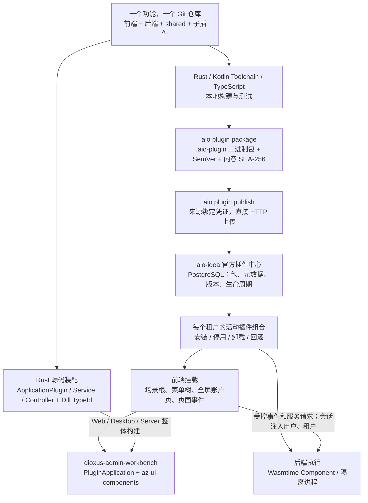

# aio-platform

`aio-platform` 是插件开发平台，`aio-idea` 是使用它组装的应用产品。平台提供 CLI、无头插件契约、共享壳和多语言发布协议；[aio-idea](https://github.com/zjarlin/aio-idea) 负责公网运行时、租户组合和官方插件中心。命令仍为 `aio`，公开应用地址为 [aio.addzero.site](https://aio.addzero.site)。

## 架构



## 插件机制

前后端是同一插件内部的职责，不是两个 Git 仓库。`client/`、`server/`、`shared/` 或 KMP 模块是源码布局；父插件及其子插件共同构建、发布和回滚。Rust 扩展使用 Dill 与 `TypeId`；Git 来源、页面 ID 和包摘要分别是发布来源、导航标识和产物版本，不替代运行时类型身份。

| 扩展 | 机制 | 更新方式 |
| --- | --- | --- |
| Dioxus 页面与原生 Rust 服务 | `ApplicationPlugin`、Service、Controller 经 Dill 装配，Web/Desktop 复用页面代码 | 源码装配后整体构建发布，不宣称单插件热替换 |
| 跨语言页面 | 插件返回正式 `PageDefinition`，壳聚合场景根、菜单和账户入口 | 当前租户安装后刷新目录，无需重编译壳 |
| 页面按钮事件 | Component `handle` 或 process `/aio/action` 接收宿主注入的上下文，返回经过校验的页面状态 | 状态按租户、版本和页面保存 PostgreSQL |
| 轻量后端 | `aio:plugin/page@1` WIT，Wasmtime 按租户和版本隔离实例 | 健康检查后激活，失败保留旧实例与活动版本 |
| JVM / Node 服务 | digest 锁定镜像、只读文件系统、非 root、资源限额、受控路由代理 | 独立进程生命周期和回滚 |

顶部场景选择菜单树的根，侧栏只显示该根下的树。账户插件贡献的设置、市场、个人资料等页面独立全屏打开，返回时保留主后台状态。壳不把场景重复显示成侧栏分组。

在线二进制包由插件作者在自己的工具链中构建，`aio plugin publish` 直接上传到插件中心，不需要 GitHub Actions，也不要求把编译产物提交到 Git。中心保存完整包，按内容 SHA-256 锁定运行字节；清单、能力、健康检查或激活失败不会替换上一活动版本。已成功发布的包可以下载或从数据库离线重装，Git registry 仅作为额外发现来源。

目前在线 UI 使用 `PageDefinition`。共享包协议已支持前端编译资产与后端共同打包、摘要校验和版本锁定，见[联合包契约](docs/plugin/frontend-bundle.md)。Dioxus 二进制前端的隔离挂载、前后端通信桥及跨平台运行验收尚未交付；源码 Dioxus 路径与跨语言 Component 路径不能混称为同一种热替换能力。宿主必须在接通挂载能力之前拒绝激活前端联合包，npm 正式发布也仍待完成。

开发规约：[总览](docs/plugin/README.md)、[Rust/Dioxus](docs/plugin/rs-plugin-convention.md)、[Kotlin](docs/plugin/kt-plugin-convention.md)、[TypeScript](docs/plugin/ts-plugin-convention.md)、[二进制发布](docs/plugin/publish.md)。AI 开发入口为 `.agents/skills/aio-plugin-development/SKILL.md`。

## Studio

平台内的 Studio 是数据库原生的 Dioxus 低代码应用。PostgreSQL 保存正式 `ProgramDefinition`，Studio 根据定义生成页面、领域 Service 契约与 Controller，再编译为 `ProgramImage` 发布。生成文件只是类型检查和实现扩展点，不反向成为业务定义真源。

```text
拖拽 / AI Vibe
    -> PostgreSQL Draft
    -> 类型、Effect、权限、组件门禁
    -> ApplicationImage cache
    -> ArcSwap 原子发布
    -> Dioxus 动态渲染与 Graph VM
```

## 目录

Rust 包按宿主、生成应用和公共运行时分为三个根目录：

```text
app/
  src/lib.rs              生成应用可复用的服务端入口
  src/main.rs             Studio 宿主目标选择入口
  src/admin_shell.rs      Web/Desktop 共用的发布应用入口
  src/application_startup.rs  服务端 starter 宿主状态
  src/application_starters/   Bevy 风格服务端插件组
  plugins/studio/         低代码定义、编译与运行时
  migrations/             PostgreSQL 正式协议迁移
  assets/                 应用静态资源
cli/                      `aio` 初始化、源码装配、二进制打包与发布
docs/plugin/              Rust、Kotlin、TypeScript 社区插件规约
marketplace/              用于额外发现与冷启动的 Git registry
generated/
  apps/<application-id>/  从不可变 Revision 生成、可整体删除重建的 Web、Desktop、Server 工程
lib/
  biz/<application-id>/   生成 Service 契约、Controller 与人工 Service 实现槽
  plugin/core/            通用 Plugin<T> 与插件公共契约
  plugin/manifest/        PageDefinition、WIT、清单与语义验证
  plugin/package/         CLI 与宿主共用的二进制包和摘要协议
```

`app/plugins/studio` 拥有 AIO 的 ProgramGraph、编辑器、编译器、发布器、Graph VM、发布应用适配和 REST/SSE。通用应用壳与基础组件统一来自 submodule [`dioxus-admin-workbench`](https://github.com/zjarlin/dioxus-admin-workbench) 中的 `az-dioxus-admin-shell` 和 `az-ui-components`，AIO 不保存壳层、组件或 CSS 副本。

`lib/plugin/core` 的 Cargo 工件名是 `az-plugin-core`，提供 Bevy 风格的 `App<T>`、`Plugin<T>`、`PluginGroup<T>`，以及 HTTP 边界、共享 PostgreSQL 句柄、动态模型和 JSONB 记录。Dill 聚合具体类型，插件唯一性只按 `TypeId` 校验。

## 依赖方向

```text
az-aio-app
  -> az-studio
  -> az-biz-<application-id>
  -> az-plugin-core

az-studio -> az-plugin-core
```

模型、页面、菜单与 REST 契约进入 PostgreSQL `ProgramDefinition`。`ApplicationCompiler` 只在 `generated/apps/<application-id>` 生成普通页面函数与发布应用壳；`BusinessModuleManager` 在 `lib/biz/<application-id>` 生成 Service trait 和 Controller，并只在缺失时创建 `src/generated/<feature>/service_impl.rs` 人工实现槽。Controller 由 Dill 按 `TypeId` 聚合，endpoint `SymbolId` 只用于连接业务元数据。

`lib/biz/<application-id>` 是业务 Service 与 Controller 库，`generated/apps/<application-id>` 是引用该业务库的可执行发布装配，两者不是重复实现。Service 骨架由内容哈希跟踪：未修改的骨架随接口元数据删除，人工修改后立即脱离生成器所有权。Studio 的“应用”视图通过 `ApplicationCompiler` 预览并原子替换生成目录；普通 GraphPatch、Vibe 和回滚都会同步清理失效页面源码。生成目录只包含可编译源码、Cargo/Dioxus 配置、Dockerfile 和部署说明；正式元数据继续以 PostgreSQL 为唯一来源。Web 与 Desktop 共享 `PublishedApplication`；Web 使用浏览器同源 HTTP，Desktop 读取 `AIO_API_BASE_URL`，Server feature 通过 `run_server_with` 注入对应业务模块。

## 开发

```bash
cargo test --workspace
cd app && dx build --platform web
./scripts/preview.zsh

# 已生成应用
dx build -p az-app-aio-first-party --platform web --release --no-default-features --features web --debug-symbols false
cargo run -p az-app-aio-first-party --no-default-features --features desktop
cargo run -p az-app-aio-first-party --no-default-features --features server
```

应用启动配置以明文保存在仓库根目录 `.env`。`AZ_AIO_DATABASE_URL` 配置正式 PostgreSQL，`AZ_AIO_DATABASE_MIGRATIONS_ENABLED` 控制 SQLx 迁移并默认启用，`AZ_AIO_WEB_PORT` 配置 Web 监听端口（未配置时默认为 `8080`），`AZ_AIO_WEB_DIST` 可覆盖 Web 产物目录。当前仓库 `.env` 将 Web 端口配置为 `3000`。`scripts/preview.zsh` 会先验证直连数据库；直连不可用时，经本机 SOCKS relay 回退到同一数据库，且不会修改 `.env`。启动后访问 `http://127.0.0.1:3000/`。

服务端 starter 统一实现 `Plugin<ApplicationStartup>`。`AioPlugins` 像 Bevy 的 `PluginGroup` 一样显式声明构建顺序，`App` 负责按 `TypeId` 做唯一性校验和逐个构建；Dill 负责 Starter 及其全部服务依赖的构造和 `AllOf` 聚合，`ApplicationStartup` 只保存最终顺序合并的 Router。

当前数据库迁移、共享数据库、Capability、Controller、ProgramRuntime、页面与业务模块同步、Studio HTTP 和静态 Web 均由 `AioPlugins` 构建。`server.rs` 只保留配置、Dill Catalog、Tokio listener、`App` 构建和 `axum::serve`。

## 初始化应用与 Git 全栈插件

```bash
# npm 尚未正式发布；当前从源码安装，目标包名为 @addzero/aio
cargo install --path cli
aio init my-app --title "我的应用"
aio plugin init my-pages --title "业务页面"
aio plugin init my-kmp-service --title "KMP 服务" --language kotlin
aio plugin init my-ts-component --title "TS 页面" --language typescript
aio plugin init my-kmp-pages --title "KMP 页面" --language kotlin --runtime page-definition
aio plugin init my-kmp-component --title "KMP Component" --language kotlin --runtime wasm-component
aio plugin init my-ts-pages --title "TS 静态页面" --language typescript --runtime page-definition
aio plugin init my-node-service --title "Node 服务" --language typescript --runtime process

cd my-app
aio plugin install https://example.com/team/my-pages.git
aio plugin list
aio plugin sync
aio plugin validate ../my-pages
aio plugin uninstall https://example.com/team/my-pages.git
```

构建在线插件后，可以在不含 `.git` 的目录中打包和发布：

```bash
aio plugin validate ../my-kmp-service
aio plugin package ../my-kmp-service --git https://example.com/team/service.git --version 1.0.0
aio plugin publish ../my-kmp-service/dist/plugin.aio-plugin
```

发布凭证通过 `AIO_PLUGIN_PUBLISH_TOKEN` 提供；默认目标是官方插件中心，私有中心可覆盖 `AIO_PLUGIN_PUBLISH_URL`。Kotlin、TypeScript 的构建命令见各语言规约，构建不会在生产安装阶段执行。

语言决定常规初始化目标：Rust 固定生成源码插件，Kotlin 默认生成 `process`，TypeScript 默认生成 `wasm-component`。`--runtime` 是 Kotlin/TypeScript 的高级覆盖选项，通常只在生成静态页面或非默认目标时传入；Rust 不接受运行目标选择。Rust 页面扩展实现 `ApplicationPlugin` 后由 Dill 聚合，Service 和 Controller 则按具体类型注册和构造，`TypeId` 是唯一运行时身份。

新应用直接消费 `az-dioxus-admin-shell::PluginApplication`，同时提供 Web、Desktop 和 Server 三个互斥构建目标。本地页面与插件客户端实现 `ApplicationPlugin`；插件服务端通过 Dill 注册 Service/Controller，再贡献 Router。Dill 聚合具体插件类型并按 `TypeId` 拒绝重复类型，页面 id 只承担业务导航身份。

插件仓库根目录使用最小清单：

```toml
[plugin.client]
path = "client"

[plugin.server]
path = "server"
```

源码应用在 `aio.toml` 配置 Git 来源和可选 revision，`.aio/plugins.lock` 保存解析后的提交与前后端包。`aio plugin sync` 负责 checkout、读取清单、发现 Cargo 包、更新 feature 依赖并生成两端注册入口；`uninstall` 反向删除注册、依赖和缓存。在线发布则使用 `.aio-plugin` 二进制包，以包摘要锁定版本；这两条路径的构建和更新边界不同。CLI 不加载动态库，也不在安装阶段执行插件自定义脚本。

社区开发入口是仓库 Skill `.agents/skills/aio-plugin-development`。完整运行边界见 [`docs/plugin`](docs/plugin/README.md)，市场条目位于 [`marketplace/registry`](marketplace/registry/README.md)。公网壳已通过 Wasmtime 执行 `aio:plugin/page@1` Component，按租户、来源和 revision 管理可销毁实例，并用 PostgreSQL 保存每个租户的 Git 来源、提交、活动版本和生命周期事件。Kotlin/TypeScript 可执行插件由容器监督器在线安装和回滚；当前只开放预置 digest 镜像与零额外能力档。

## 许可证

本项目以 MIT 或 Apache-2.0 双重许可发布，完整文本见 `LICENSE-MIT` 和 `LICENSE-APACHE`。
